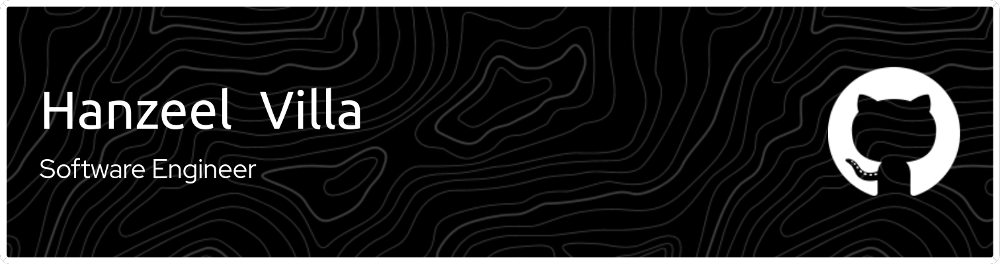

#  Hello there 👻

## About me

I’m in my last year of my software engineering degree, specializing in back-end development with **Express.js** and **Django**. I have experience working with **WebSockets**, **MongoDB**, and **MySQL**, building real-time and data-driven applications. Currently, I’m learning **React.js** to expand my full-stack development skills. I’m always eager to learn new technologies and take on new challenges. Let’s connect! 😎

## Interest
- IoT 🤖
- Videogames 🕹️
- Music 🥁
- Sports 🥊

## TECH ☝️🤓

                    

## Get in touch

 <a href="https://www.linkedin.com/in/hanzeelvilla" target="_blank" rel="noreferrer"> <picture> <source media="(prefers-color-scheme: dark)" srcset="https://raw.githubusercontent.com/danielcranney/readme-generator/main/public/icons/socials/linkedin-dark.svg" /> <source media="(prefers-color-scheme: light)" srcset="https://raw.githubusercontent.com/danielcranney/readme-generator/main/public/icons/socials/linkedin.svg" />  </picture> </a>
