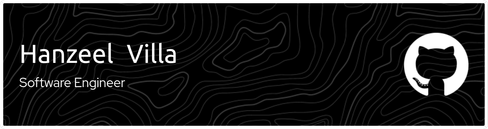

#  Hello there 👻

## About me

Hi! I'm a **Software Engineer** focused on **Fullstack development**, using **TypeScript** and the **MERN stack** to build scalable applications. Beyond code, I'm an **IoT** and **3D design** enthusiast who loves bridging the gap between hardware, software, and physical modeling. Always building at the intersection of the digital and physical worlds.

## Interests
- IoT 🤖
- Videogames 🕹️
- Music 🥁
- Sports 🥊

## TECH ☝️🤓

                    

## Get in touch

 
  <a href="https://www.linkedin.com/in/hanzeelvilla" target="_blank" rel="noreferrer"> 
    <picture> 
      <source media="(prefers-color-scheme: dark)" srcset="https://raw.githubusercontent.com/danielcranney/readme-generator/main/public/icons/socials/linkedin-dark.svg" /> 
      <source media="(prefers-color-scheme: light)" srcset="https://raw.githubusercontent.com/danielcranney/readme-generator/main/public/icons/socials/linkedin.svg" /> 
       
    </picture> 
  </a>
  <a href="https://www.instagram.com/hanzeelabs" target="_blank" rel="noreferrer">
    <picture>
      <source media="(prefers-color-scheme: dark)" srcset="https://raw.githubusercontent.com/danielcranney/readme-generator/main/public/icons/socials/instagram-dark.svg" />
      <source media="(prefers-color-scheme: light)" srcset="https://raw.githubusercontent.com/danielcranney/readme-generator/main/public/icons/socials/instagram.svg" />
      
    </picture>
  </a>

